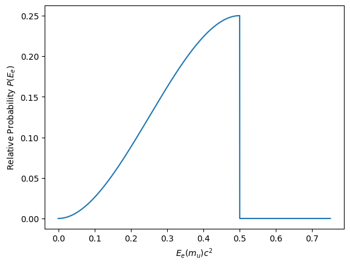

```python
from pimontecarlo import *
```

# Pi Monte Carlo

This project is for a lab class at UMass Amherst in 2019. An experiment was done to measure the mass of a muon using cosmic microwave background radiation (CMBR). CMBR is a shower of particles that is always coming down onto the Earth from outer space. It is thought to be a result of the big bang. Some of these particles are called muons ($\mu$) which are similar to electrons but more massive. Muons will spontaneously decay into an electron, which means that they will suddenly change into an electron, releasing energy. A sample of Aluminum was set up to capture muons and measure their path. The size of the path depends on the mass of the muon.

This README was not created during this time, and is written in 2025 to the best of my memory.

# piPlot

Below, find the piPlot method, which is used to demonstrate an important statistical concept, the central limit theorem. This method of calculating pi ($\pi$) uses the fact that $\pi$ is related to the area of a circle. A certain number $(N = 1000)$ of points are plotted with a uniformally random uniform $x$ coordinate and uniformally random $y$ coordinate between 0 and 1. The points that are within a distance of 1 from the origin are labelled blue, and the points that are not are labelled red. Dividing the number of blue points by $N$ should give $\pi/4$. The estimate of pi is labelled:


```python
piPlot(1000,plot=True)
```


    3.112


    

    


## Central Limit Theorem

Below is the method CLT($N$) which stands for Central Limit Theorem. The Central Limit Theorem means that the more samples you have in a distribution, the closer the distribution should be to the ideal distribution. This method simulates the sum of two rolled 6 sided dice $N$ times. The first distribution below uses $N=100$, which shows a rather suboptimal distribution. The second distribution shows a much better curve


```python
CLT(100)
```


    

    


```python
CLT(1000)
```


    

    


## Electron Energy Distribution


```python
plotElectronDist()
```


    

    


```python
data = MC(100,True)
```


    

    


```python
go()
```


    

    

